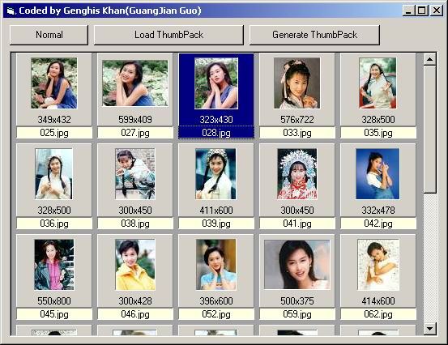



## GpPicview1\.1

### Description

load and preview images,like as acdsee.

Intel JPG Library(ijl15.zip) is needed: http://www.itkhan.com/reference/ijl15.zip

ADDED: CreateThumbImagePack method

ADDED: LoadThumbPack method

FIXED:

you can Pack thumbnail images by scaling the image to the size specified in the thumbWidth and thumbHeight parameters to a file, and load the specified thumbpack file to display every thumbnail images
 
### More Info
 

             |
---                |---
**Submitted On**   |2003-05-12 20:38:46
**By**             |[Genghis Khan](https://github.com/Planet-Source-Code/PSCIndex/blob/master/ByAuthor/genghis-khan.md)
**Level**          |Intermediate
**User Rating**    |4.8 (29 globes from 6 users)
**Compatibility**  |VB 6\.0
**Category**       |[Custom Controls/ Forms/  Menus](https://github.com/Planet-Source-Code/PSCIndex/blob/master/ByCategory/custom-controls-forms-menus__1-4.md)
**World**          |[Visual Basic](https://github.com/Planet-Source-Code/PSCIndex/blob/master/ByWorld/visual-basic.md)
**Archive File**   |[GpPicview11586995132003\.zip](https://github.com/Planet-Source-Code/genghis-khan-gppicview1-1__1-45449/archive/master.zip)

